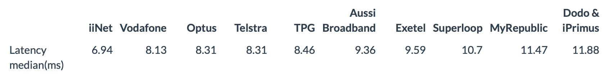

# The Analysis of the NBN100 Broadband Plan provided by the Retail Service Providers in New South Wales
_This is my project 3 of the DATA1901 Foundation of Data Science 2022 Semester 1 unit._

_Source: [Measuring Broadband Australia Report 15 Dataset Release](https://data.gov.au/data/dataset/measuring-broadband-australia-report-15-dataset-release)_

## 1. Recommendation
The clients are the New South Wales citizens looking for a 100/40 Mbps broadband plan for their family. Based on the speed, reliability, and price, I would recommend choosing Exetel because it has the best cost-performance ratio.

## 2 Evidence
This report analyses consistency and reliability of the 100/40 Mbps plan provided by different retail service providers. The median of 1% trimmed mean download speed, upload speed, and latency in busy hours are used to evaluate the consistency of the speed. The median of average outages per day evaluates the reliability of the network. Median is used to estimate the center of the data due to the non-normal distribution of the sample and the presence of extreme outliers. One of the limitations of the speed analysis is that the sample size of Dodo & iPrimus and Vodafone are only 2 and 3 respectively, hence the result may not be accurate.

## 2.1 Download Speed Analysis

In terms of the median, we can see that six of the RSPs deliver 100+ Mbps download speed during busy hours with MyRepublic and Optus being the fastest. The download speed of Aussie Broadband is slightly under 100 Mbps. On the other hand, Vodafone, iiNet, and Dodo & iPrimus are three of the slowest RSPs.

## 2.2 Upload Speed Analysis

In terms of the median, we can see that none of the RSPs reach the 40 Mbps upload speed they claimed during busy hours. MyRepublic outperforms the others by a significant difference whereas Superloop has the slowest speed. The speed of the rest of the RSPs is between 37 to 38 Mbps.

## 2.3 Latency Analysis

For the latency test, iiNet has the lowest latency at 6.94 ms whereas Superloop, MyRepublic, and Dodo & iPrimus have the highest latency at 10.70 ms, 11.47 ms, and 11.88 ms respectively. The rest of the RSPs have latency between 8 ms to 10 ms.

## 2.4 Outage Analysis

For the reliability aspect, the most reliable RSP is iiNet, the median of the outages per day is zero which means at least half of its sample has zero outage. On the other hand, the least reliable RSP is MyRepublic, the median of the outages per day is 0.15 times which is much higher than others. The medians of the outages per day of the rest of the RSPs lay between 0.03 times to 0.08 times.

## 2.5 Price and Current Available Plans
After visiting the website of all RSPs, I found out that only MyRepublic, Exetel, Superloop, and Aussie Broadband provide 100/40 Mbps currently. The prices per month are listed below in increasing order:

- MyRepublic: $89($79 the in first 6 months)
- Exetel: $98.95($79.95 the in first 6 months)
- Superloop: $98.95($79.95 the in first 6 months)
- Aussie Broadband: $109

# 3 Acknowledgments
1. [MyRepublic Website](https://myrepublic.net/au/nbn-plans-and-pricing/)
2. [Exetel Website](https://www.exetel.com.au/broadband/nbn?gclid=Cj0KCQjwspKUBhCvARIsAB2IYuuZAZO8qFgBOpUyluNTMKLkEJ0bQzv31fJ4h61mv6txSXEX_ChaADkaAmkfEALw_wcB)
3. [Superloop Website](https://www.superloop.com/consumer/home-broadband/nbn.html?referral_method=Google%20Ads&gclid=Cj0KCQjwspKUBhCvARIsAB2IYutIeCP8LKlOwc3QfeskeYgnqHhkT_4FRU8rHFdds-zx7cZkSKLS3gkaAg5SEALw_wcB)
4. [Aussie Broadband Website](https://www.aussiebroadband.com.au/nbn-plans/)
